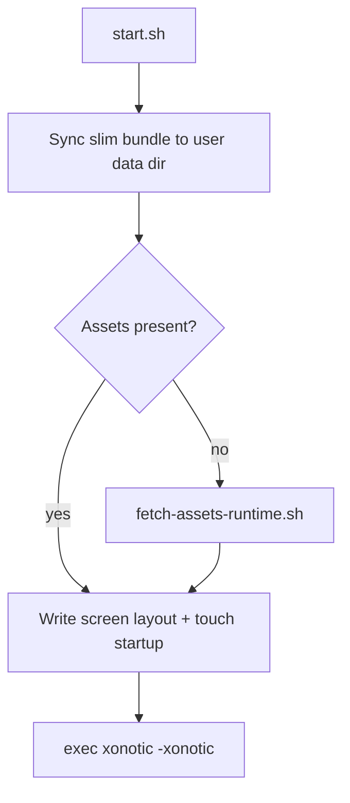

# Xonotic Touch: Technical Architecture

Native C + QuakeC touch port. **Slim packages** ship compiled logic and touch configs; large game assets download on first launch into `~/.local/share/xonotic-touch/`.

## 1. Roles

| Role | Compiles? | Actions |
|------|-----------|---------|
| Maintainer | Optional | Edit `engine/`, push; CI builds packages |
| Tester (Flatpak) | No | Install from public Flatpak remote or release bundle |
| Tester (UT) | Yes (Clickable) | `clickable build --arch arm64`, `clickable install` |

## 2. Core architecture

| Component | Location |
|-----------|----------|
| Engine | `engine/darkplaces/` (`gettouchfinger`, `DP_UT_TOUCHFINGER`) |
| Menus / HUD / controls | `engine/data/xonotic-data.pk3dir/qcsrc/` |
| Touch defaults | `touch/xonotic.cfg` |
| Touch presets | `touch/profiles/*.cfg` |
| Screen layout | `touch/screen-calc.sh` |
| Launcher | `packaging/start.sh` — sync bundle, fetch assets, launch |
| Runtime assets | `scripts/fetch-assets-runtime.sh` → user data dir |
| Flatpak | `flatpak/io.github.dixonSolutions.XonoticTouch.yml` |
| Click | `clickable.json` → `scripts/install.sh` |

## 3. Repository layout

```
engine/              # Full Xonotic fork; touch changes integrated in-tree
touch/               # xonotic.cfg, screen-calc.sh, profiles/
packaging/           # start.sh
flatpak/             # Flatpak manifest + metadata
scripts/             # build, stage-slim-data, fetch-assets-runtime
.github/workflows/   # Flatpak + Click CI, Pages remote, releases
```

## 4. Launch flow



Bundled data (in package): compiled QuakeC, configs, fonts, touch profiles.

User cache (`$XDG_DATA_HOME/xonotic-touch/data/`): textures, models, gfx, sound, maps, music (downloaded once).

## 5. Packaging

| Format | ID | CI job |
|--------|-----|--------|
| Flatpak | `io.github.dixonSolutions.XonoticTouch` | `flatpak-x86_64`, `flatpak-aarch64` |
| Click | `xonotic-touch.ratrad` | `click-arm64` |

Public Flatpak remote: GitHub Pages OSTree repo (see [RELEASES.md](RELEASES.md)).

## 6. Docs

- [RELEASES.md](RELEASES.md)
- [MAINTAINING.md](MAINTAINING.md)
- [TESTING.md](TESTING.md)
- [SOURCES.md](SOURCES.md)
- [SCREEN.md](SCREEN.md)
- [CONTROLS.md](CONTROLS.md)
