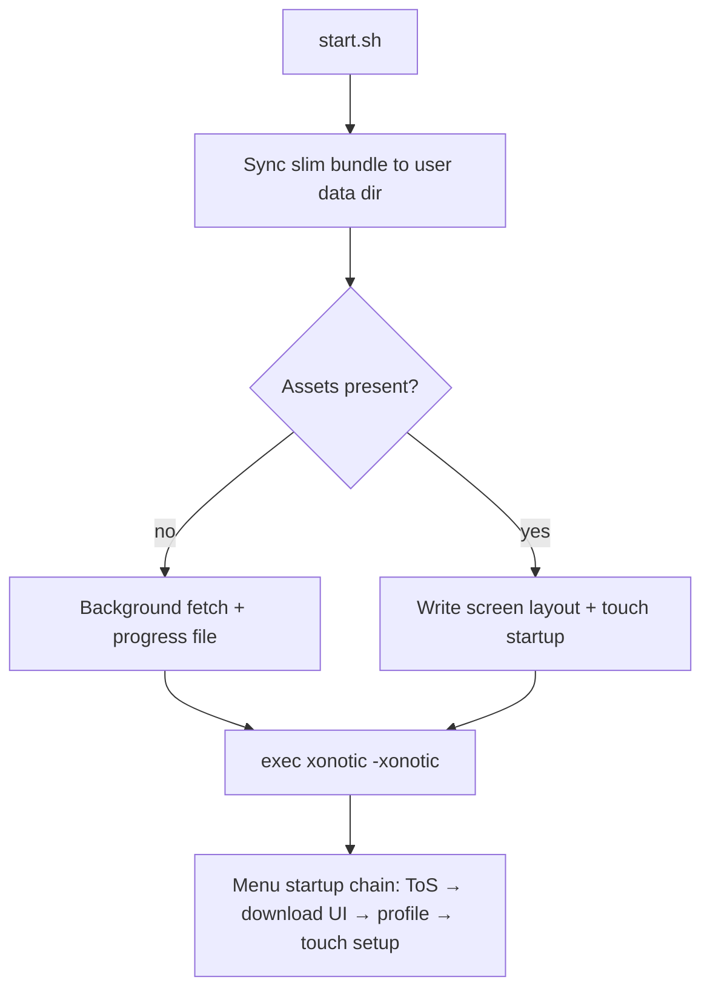

# Xonotic Touch: Technical Architecture

Native C + QuakeC touch port for Linux touch tablets and phones. **Slim Flatpak packages** ship compiled logic and touch configs; large game assets download on first launch into `~/.local/share/xonotic-touch/`.

## 1. Roles

| Role | Compiles? | Actions |
|------|-----------|---------|
| Maintainer | Optional | Edit `engine/`, push; CI builds Flatpak on `main` |
| User / tester | No | Install from Flatpak remote or GitHub Releases |

## 2. Core architecture

| Component | Location |
|-----------|----------|
| Engine | `engine/darkplaces/` (`gettouchfinger`, touch input) |
| Menus / HUD / controls | `engine/data/xonotic-data.pk3dir/qcsrc/` |
| Touch defaults | `touch/xonotic.cfg` |
| Touch presets | `touch/profiles/*.cfg` |
| Screen layout | `touch/screen-calc.sh` |
| Launcher | `packaging/start.sh` — sync bundle, background asset fetch, launch |
| Runtime assets | `scripts/fetch-assets-runtime.sh`, `scripts/lib/asset-fetch.sh` |
| First-run UX | In-game wizard chain + download progress — [SETUP.md](SETUP.md) |
| Flatpak | `flatpak/io.github.dixonSolutions.XonoticTouch.yml` |

## 3. Repository layout

```
engine/              # Xonotic fork; touch changes integrated in-tree
touch/               # xonotic.cfg, screen-calc.sh, profiles/
packaging/           # start.sh
flatpak/             # Flatpak manifest + metadata
scripts/             # build, stage-slim-data, fetch-assets-runtime, installers
.github/workflows/   # Flatpak CI, Pages remote, GitHub Releases
```

## 4. Launch flow



Asset download runs in parallel with the game when needed; progress is shown in `XonoticTouchAssetFetchDialog`. See [SETUP.md](SETUP.md).

## 5. Packaging

| Format | ID | CI |
|--------|-----|-----|
| Flatpak | `io.github.dixonSolutions.XonoticTouch` | Yes — every `main` push |

Public Flatpak remote: GitHub Pages OSTree repo (see [RELEASES.md](RELEASES.md)).

## 6. Docs

- [RELEASES.md](RELEASES.md)
- [MAINTAINING.md](MAINTAINING.md)
- [TESTING.md](TESTING.md)
- [SOURCES.md](SOURCES.md)
- [SCREEN.md](SCREEN.md)
- [CONTROLS.md](CONTROLS.md)
- [SETUP.md](SETUP.md) — first-run wizard, asset progress, touch menus, OSK
