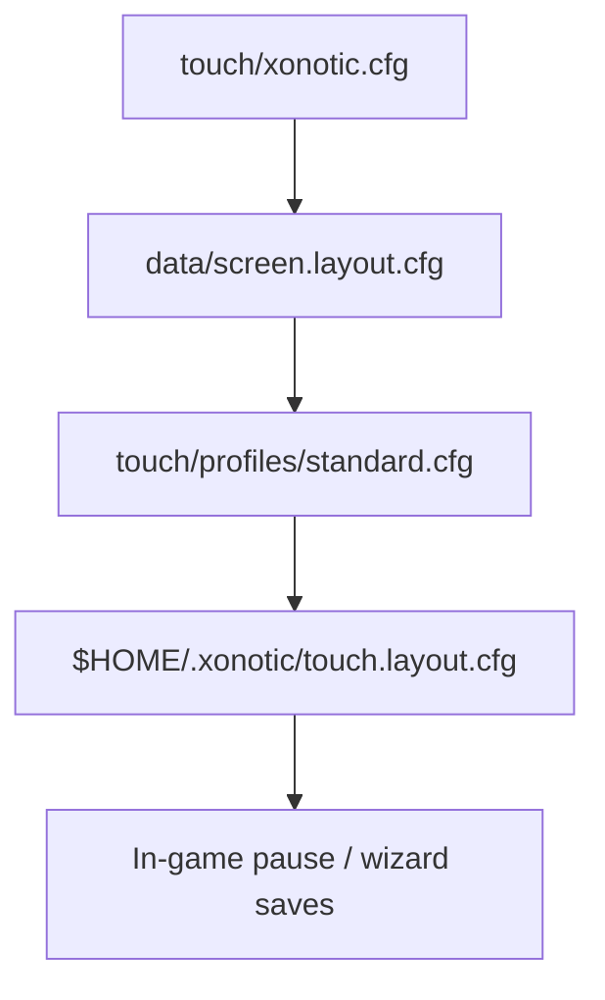
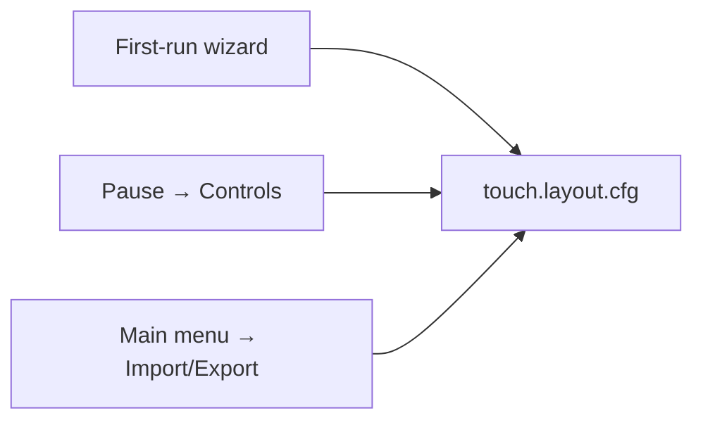

# Touch controls layer

Landscape-first **two-thumb arena** controls for Ubuntu Touch. Ship defaults live in **`touch/xonotic.cfg`** and **`touch/profiles/`**; per-player overrides persist on device. CSQC implementation targets `engine/data/xonotic-data.pk3dir/qcsrc/client/` (see [SOURCES.md](SOURCES.md)).

Related: [SCREEN.md](SCREEN.md) (resolution / DPI), [ARCHITECTURE.md](ARCHITECTURE.md) (repo layout).

---

## Contents

1. [Design goals](#design-goals) · [Default layout](#default-arena-touch-standard-preset)
2. [Config layering](#config-layering) · [Cvar schema](#cvar-schema)
3. [Presets](#preset-bundles-touchprofiles) · [Settings UI](#settings-ui-intent-groups)
4. [Session flow](#session-flow-menus) · [In-game UX](#in-game-ux-beyond-overlay)
5. [Platform / online](#ubuntu-touch-platform) · [Export/import](#export--import)
6. [Implementation map](#implementation-map)

---

## Design goals

| Layer | Answers | User-facing term |
|-------|---------|------------------|
| **Layout** | Where widgets sit on screen | Geometry, customize mode |
| **Feel** | How look / move / fire behave | Sensitivity, smoothing, aim assist |
| **Presets** | One-tap bundles | Standard, Casual, Competitive, … |
| **Performance** | Battery vs quality trade-offs | Battery / Balanced / Quality |

Players pick a **preset first**, then tweak sliders. Layout and feel are separate in the settings UI even when stored in one file.

---

## Default: Arena touch (Standard preset)

Two-thumb layout tuned for Xonotic strafe movement and nine weapons.

```
┌─────────────────────────────────────────────────────────┐
│  [HP/armor]  [ammo/weapon]                              │
│                                                         │
│                              RIGHT ~60% = look (drag)   │
│                              (no buttons except edges)  │
│                                                         │
│   ┌──────┐                         ┌───────┐            │
│   │ MOVE │                         │ FIRE  │            │
│   │ stick│              [JUMP][CR][WEAP][ZOOM] (hold)   │
│   └──────┘                         └───────┘            │
└─────────────────────────────────────────────────────────┘
```

| Zone | Input | Engine / QC binding |
|------|-------|---------------------|
| Left stick | Analog move | `+forward`, `+back`, `+moveleft`, `+moveright` |
| Right ~60% | Drag = look | Mouse delta → yaw/pitch (`sensitivity`, `m_pitch`, `m_yaw`) |
| Fire | Hold (default) | `+attack` |
| Jump / Crouch | Tap or hold | `+jump`, `+crouch` |
| Weapon | Tap → wheel (default) | `impulse 1`…`9` or cycle |
| Reload | Tap | `weapon_reload` |
| Mobile HUD | Top-left / top-right | Portrait, HP/AR bars, clip/reserve ammo |

**Avoid as default:** full-screen move + aim stick, pure tap-to-move, fire on the look zone.

---

## Config layering

Applied at launch (bottom → top; later wins):



| Step | File | Writable | Role |
|------|------|----------|------|
| 1 | `data/xonotic.cfg` | No (click package) | Port gameplay + graphics baseline from `touch/xonotic.cfg` |
| 2 | `data/screen.layout.cfg` | Regenerated each launch | `vid_width`, `vid_height`, DPI ([SCREEN.md](SCREEN.md)) |
| 3 | `data/touch/profiles/<preset>.cfg` | No | Layout + feel + optional performance bundle |
| 4 | `~/.xonotic/touch.layout.cfg` | Yes | Player overrides (`CF_ARCHIVE` cvars + layout) |

Override preset at launch (testers):

```bash
XONOTIC_TOUCH_PROFILE=casual bin/start.sh
```

Stack a performance profile after a layout preset (CSQC menu or manual `exec`):

```
exec touch/profiles/competitive.cfg
exec touch/profiles/battery.cfg
```

---

## Cvar schema

All `touch_*` cvars are **port extensions**. Register in CSQC with `registercommand` / `cvar` and `CF_ARCHIVE` so the engine persists them in the user config. Until CSQC registers them, lines in profile `.cfg` files are inert but document the contract.

### Layout (geometry)

Normalized coordinates use **fractions of `vid_width` / `vid_height`** (0.0–1.0), origin top-left, landscape long edge = width.

| Cvar | Type | Range | Default (Standard) | Notes |
|------|------|-------|-------------------|-------|
| `touch_preset` | string | — | `"standard"` | Active preset id; shown in UI |
| `touch_scale` | float | 0.8–1.3 | `1.0` | Multiplier on `vid_touchscreen_density` for all widgets |
| `touch_opacity` | float | 0.3–1.0 | `0.65` | Overlay alpha |
| `touch_move_x` | float | 0–1 | `0.12` | Move stick center X |
| `touch_move_y` | float | 0–1 | `0.72` | Move stick center Y |
| `touch_move_size` | float | 0.05–0.25 | `0.18` | Stick radius as fraction of min(vid_w, vid_h) |
| `touch_fire_x` | float | 0–1 | `0.88` | Fire button center X |
| `touch_fire_y` | float | 0–1 | `0.72` | Fire button center Y |
| `touch_fire_size` | float | 0.08–0.20 | `0.14` | Fire hit target size |
| `touch_jump_x` | float | 0–1 | `0.72` | |
| `touch_jump_y` | float | 0–1 | `0.82` | |
| `touch_jump_size` | float | | `0.11` | Slightly larger (Fitts) |
| `touch_crouch_x` | float | 0–1 | `0.62` | |
| `touch_crouch_y` | float | 0–1 | `0.82` | |
| `touch_crouch_size` | float | | `0.10` | |
| `touch_weapon_x` | float | 0–1 | `0.52` | |
| `touch_weapon_y` | float | 0–1 | `0.82` | |
| `touch_weapon_size` | float | | `0.11` | |
| `touch_zoom_x` | float | 0–1 | `0.42` | |
| `touch_zoom_y` | float | 0–1 | `0.82` | |
| `touch_zoom_size` | float | | `0.10` | |
| `touch_dodge_x` | float | 0–1 | `0.12` | Optional; near move stick |
| `touch_dodge_y` | float | 0–1 | `0.58` | |
| `touch_dodge_size` | float | | `0.10` | |
| `touch_dodge_visible` | int | 0/1 | `1` | Mobile default: dodge **button on** |
| `touch_look_zone_left` | float | 0–1 | `0.45` | Left edge of look drag region |
| `touch_look_zone_right` | float | 0–1 | `1.0` | Right edge (usually full width) |
| `touch_edge_deadzone_px` | int | 8–24 | `16` | Ignore touches near bezels (UT edge gestures) |
| `touch_handedness` | int | 0/1 | `0` | `0` = right-hand look zone; `1` = mirrored |

**Left-handed mirror:** for each widget, `x' = 1.0 - touch_*_x - touch_*_size` (CSQC applies when `touch_handedness 1` or load `left.cfg`).

**Customize mode (CSQC):** semi-transparent overlay, drag handles, snap to corners, actions: Reset preset, Save → `touch.layout.cfg`, Test range (30 s sandbox).

### Feel (aim & movement)

| Cvar | Type | Range | Standard | Maps to / notes |
|------|------|-------|----------|-----------------|
| `touch_sens_base` | float | 1.5–5.0 | `3.5` | UI “Medium”; DPI-normalized before `sensitivity` |
| `touch_sens_y_mult` | float | 0.5–1.5 | `1.0` | Vertical look multiplier vs horizontal |
| `touch_invert_y` | int | 0/1 | `0` | Flip pitch |
| `touch_look_smoothing` | int | 0–2 | `1` | 0=off, 1=low, 2=med (average last N deltas) |
| `touch_look_deadzone_px` | int | 0–20 | `8` | Ignore micro-jitter on glass |
| `touch_stick_deadzone` | float | 0–0.35 | `0.15` | Analog move drift prevention |
| `touch_stick_range` | float | 0.5–1.0 | `1.0` | Max deflection → max speed |
| `touch_aim_assist` | int | 0–2 | `0` | 0=off, 1=light, 2=strong (CSQC magnetism) |
| `touch_gyro_enabled` | int | 0/1 | `0` | SDL sensor → yaw/pitch (optional) |
| `touch_gyro_sens` | float | | `0.5` | |
| `touch_gyro_ads_only` | int | 0/1 | `1` | Gyro only while `+zoom` held |

**DPI-normalized sensitivity** (apply in CSQC each frame or on cvar change):

```
effective_sens = touch_sens_base * (320.0 / vid_touchscreen_xdpi)
sensitivity    = effective_sens
m_yaw          = 0.022 * (touch_sens_y_mult > 0 ? 1.0 : 1.0)   // horizontal
m_pitch        = 0.022 * touch_sens_y_mult * (touch_invert_y ? -1 : 1)
```

Reference density: 320 dpi ([SCREEN.md](SCREEN.md)). “Medium” should feel similar on Volla and PinePhone.

Engine movement (already in `touch/xonotic.cfg`):

| Cvar | Default | Purpose |
|------|---------|---------|
| `cl_movement` | `1` | Client-side prediction (required for responsive touch) |
| `cl_movement_maxspeed` | `320` | Cap match desktop feel |
| `cl_movement_jumpvelocity` | `270` | Jump height |

### Behavior (buttons & gestures)

| Cvar | Type | Values | Default | Notes |
|------|------|--------|---------|-------|
| `touch_fire_mode` | int | 0=hold, 1=toggle | `0` | Hold for arena FPS |
| `touch_zoom_mode` | int | 0=hold, 1=toggle | `0` | |
| `touch_weapon_mode` | int | 0=wheel, 1=3slot, 2=cycle | `0` | Competitive → `1` |
| `touch_weapon_slot1` | string | weapon name | `"Laser"` | 3-slot favorites |
| `touch_weapon_slot2` | string | | `"Shotgun"` | |
| `touch_weapon_slot3` | string | | `"Grenade Launcher"` | |
| `touch_auto_fire` | int | 0/1 | `0` | Off by default |
| `touch_dodge_mode` | int | 0=button, 1=double-tap | `0` | Competitive preset may use `1` |
| `touch_scoreboard_gesture` | int | 0=edge btn, 1=two-finger tap | `1` | |
| `touch_chat_mode` | int | 0=pause only, 1=quick phrases | `1` | |
| `touch_minimal_more` | int | 0/1 | `0` | Minimal preset: secondary panel for crouch/zoom/dodge |
| `touch_setup_done` | int | 0/1 | `0` | First-run wizard completed; skip on next launch |

**Fire, zoom, weapons (recommended defaults):**

| Option | Values | Default | Notes |
|--------|--------|---------|-------|
| Fire | hold / toggle | hold (`0`) | Arena FPS; toggle breaks rhythm |
| Zoom | hold / toggle | hold (`0`) | Electro, etc. |
| Weapons | wheel / 3-slot / cycle | wheel (`0`) | Competitive → 3-slot (`1`) |
| Auto-fire | off / on | off (`0`) | Breaks balance feel |

**Optional gestures (CSQC; no extra on-screen buttons):**

| Gesture | Maps to | Preset bias |
|---------|---------|-------------|
| Swipe on weapon button | Next/prev weapon | Competitive cycle |
| Hold fire + drag look | ADS-style zoom weapons | Hold zoom default |
| Double-tap move stick dir | Dodge | Competitive (`touch_dodge_mode 1`) |
| Two-finger tap | Scoreboard | Standard (`touch_scoreboard_gesture 1`) |

### Multitouch (CSQC contract)

Implement once in `qcsrc/client/touch_input.qc` (or equivalent):

1. Finger on move stick → movement only.
2. Finger in look zone → look only (ignore if on a button hit box).
3. Fire uses its own touch id; may overlap look (fire while turning).
4. **Max 3** simultaneous: move + look + fire; drop extra touches.
5. **Palm rejection:** ignore contacts with area &gt; threshold if SDL exposes it (`SDL_FINGER` normalized or engine touch API).

Document for testers: feel bugs vs layout bugs use different cvars.

### Performance profiles

Independent of layout preset; safe to `exec` after a control preset.

| Cvar | battery | balanced | quality |
|------|---------|----------|---------|
| `touch_performance_profile` | `"battery"` | `"balanced"` | `"quality"` |
| `fps_max` | `30` | `60` | `0` (uncapped) |
| `r_picmipworld` | `2` | `1` | `0` |
| `r_picmipsprites` | `2` | `1` | `0` |
| `r_shadow_realtime_world` | `0` | `0` | `1` |
| `r_shadow_realtime_dlight` | `0` | `0` | `1` |
| `r_bloom` | `0` | `0` | `1` |
| `r_motionblur` | `0` | `0` | `0` |
| `gl_texturecompression` | `1` | `1` | `0` |
| `r_particles` | `0` | `1` | `1` |

Advanced panel (testers): show `fps` / frame time from `cl_stats` or CSQC timer for bug reports with numbers.

### Audio (menu group)

Uses engine volume cvars; port adds an output profile for phone speaker vs headphones.

| Cvar | Type | Values | Default | Notes |
|------|------|--------|---------|-------|
| `touch_audio_profile` | int | 0=speaker, 1=headphone | `0` | CSQC/menu applies EQ-ish gains to `volume`, `snd_waterfx`, etc. |
| `volume` | float | 0–1 | ship default | Master |
| `snd_waterfx` | float | 0–1 | | SFX bus |
| `bgmvolume` | float | 0–1 | | Music bus |

### Accessibility & network (menu groups)

| Cvar | Type | Default | Purpose |
|------|------|---------|---------|
| `touch_hud_scale` | float | `1.0` | HUD scale; tied to `vid_touchscreen_density` |
| `touch_reduce_shake` | int | `0` | Lower view punch / camera shake |
| `touch_colorblind_mode` | int | `0` | Team colors: 0=off, 1=deuter, 2=protan, 3=tritan |
| `touch_mobile_data_mode` | int | `0` | When `1`: `cl_curl_enabled 0`, defer map downloads |
| `touch_download_limit_kb` | int | `512` | HTTP rate cap when curl enabled |

---

## Preset bundles (`touch/profiles/`)

| File | Audience | Summary |
|------|----------|---------|
| `standard.cfg` | Most players | Arena two-thumb; dodge button; weapon wheel |
| `casual.cfg` | New to touch / Xonotic | Larger widgets, light aim assist, lower sens |
| `competitive.cfg` | Experienced | Smaller HUD, no assist, higher sens, 3-slot weapons, double-tap dodge |
| `left.cfg` | Left-handed | Mirrored Standard geometry |
| `minimal.cfg` | Small phones | 3 weapons, hidden crouch/zoom/dodge until “more” panel |
| `battery.cfg` | Long sessions | Performance row only |
| `balanced.cfg` | Default thermal | Matches `touch/xonotic.cfg` graphics |
| `quality.cfg` | Plugged in / cool device | Higher picmip / shadows |

---

## Settings UI (intent groups)

Implement in `qcsrc/menu/` — shallow tree for phone sessions (Hick’s Law).

| Menu group | Contents |
|------------|----------|
| **Controls** | Preset, look sliders, move stick, gesture toggles, layout customize entry |
| **Performance** | Battery / Balanced / Quality, FPS cap, picmip, particles |
| **Audio** | Master / SFX / music; speaker vs headphone profile |
| **Network** | Mobile-data mode, download limits, `cl_curl` |
| **Accessibility** | HUD scale, colorblind, reduced shake |

**Three entry points, one config file:**



Pause sub-tabs: Preset · Look · Move · Buttons · Layout · Advanced (export/import, reset, show cvar names).

---

## Session flow (menus)

Target `qcsrc/menu/` redesign for short mobile sessions:

- **Play now** — offline bots or last mode/map in one tap.
- **Touch setup** — first-run: preset → handedness → 30 s test range → save.
- **Server browser** — ping, players, mode filters first; details collapsed.
- **Chat** — large input + quick phrases (`gg`, `need health`).
- **Pause** — clear resume; avoid accidental app switch during combat (UT lifecycle).

---

## In-game UX (beyond overlay)

Scale from `vid_width`, `vid_height`, `vid_touchscreen_density` — never 1920×1080 constants.

| Element | Mobile approach |
|---------|-----------------|
| HUD | Less clutter; `touch_hud_scale` × density |
| Weapon select | Wheel or compact bar; edge-aligned large targets |
| Scoreboard | Full-screen overlay |
| Kill feed | Shorter lifetime, smaller type |
| Damage feedback | Stronger directional indicators |
| Intermission / vote | Large tappable rows; no hover |

---

## Gameplay defaults (mobile curation)

Set via menu defaults + cfg (not a full game rewrite):

- Default modes: FFA, duel, TDM; avoid key-heavy modes.
- Smaller bot counts; fast-loading maps for first run.
- Optional training map: move, jump, shoot, weapon switch.
- Bot difficulty default below desktop “hard” for touch aim.

---

## Ubuntu Touch platform

| Concern | Where |
|---------|-------|
| Pause on app switch | `packaging/start.sh`, engine focus loss hook if needed |
| Landscape + inverted landscape | Control remap when `touch_handedness` + orientation flip ([SCREEN.md](SCREEN.md)) |
| Large downloads | Warn in UI; cache under app writable dir |
| Network permission | AppArmor `networking`; offline mode without curl |
| Edge gestures | `touch_edge_deadzone_px` |

---

## Online / social (mobile)

- **Mobile-data mode** — no auto map download, lower HTTP limits.
- **Reconnect UX** — “Connection lost” + retry (Wi‑Fi ↔ mobile handoff).
- **Nickname** — first-run local setup.

---

## Export / import

Format: plain QuakeC `exec` text (`.cfg`), same keys as schema above.

```
// Xonotic UT touch profile — exported 2026-06-12
touch_preset "casual"
touch_sens_base 2.8
touch_move_x 0.10
...
```

Menu actions: Export → share file; Import → validate keys, backup current, `exec` imported file, save to `touch.layout.cfg`.

---

## Implementation map

| Layer | Path | Responsibility |
|-------|------|----------------|
| Ship defaults | `touch/xonotic.cfg` | Movement, baseline gfx, `vid_touchscreen 1` |
| Device scaling | `touch/screen-calc.sh` | DPI → density ([SCREEN.md](SCREEN.md)) |
| Presets | `touch/profiles/*.cfg` | Layout + feel bundles; performance profiles |
| Launch chain | `packaging/start.sh` | `exec` screen layout, default preset, user override |
| Touch CSQC | `engine/.../qcsrc/client/touch_*.qc` | Sticks, buttons, multitouch, aim assist |
| Engine fingers | `engine/darkplaces/vid_sdl.c`, `clvm_cmds.c` | `gettouchfinger` builtin (#643), `DP_UT_TOUCHFINGER` |
| Constants | `engine/.../qcsrc/common/` | Shared enums, weapon names, gesture thresholds *(pending)* |
| Settings UI | `engine/.../qcsrc/menu/xonotic/` | Sliders, wizard, touch settings tab |
| Mobile status HUD | `engine/.../qcsrc/client/touch_hud.qc` | Portrait, HP/AR, ammo readout |
| User persistence | `~/.xonotic/touch.layout.cfg` | Profile `exec` + registered cvars |
| SDL fingers | `engine/darkplaces/vid_sdl.c` | SDL multitouch → `gettouchfinger` |

### CSQC implementation status

| Module | File | Status |
|--------|------|--------|
| Cvar registration + DPI sens | `touch_init.qc` | **Done** |
| OpenGL glass UI (joystick, buttons) | `touch_glass.qc` | **Done** |
| Layout / hit tests | `touch_layout.qc` | **Done** |
| Look pipeline | `touch_look.qc` | **Done** |
| Input / multitouch / commands | `touch_input.qc` | **Done** (3-finger slots via `gettouchfinger`) |
| Overlay draw | `touch_draw.qc` | **Done** |
| Customize mode | — | *Pending* |
| Menu / wizard | `qcsrc/menu/` | *Pending* |

Build flow: clone repo (integrated `engine/`) → `fetch-sources.sh code` (if needed) → `clickable build`.

### CSQC skeleton (remaining work)

1. **`touch_customize_*`** — edit mode overlay and save to user path via `cvar_set` flush.
2. **Menu hooks** — bind sliders to cvars; first-run wizard flag `touch_setup_done`.
3. **`touch_layout_apply_preset(string name)`** — in-game `exec touch/profiles/<name>.cfg` from menu.

---

## Xonotic-specific actions

| Action | Touch mapping | Setting |
|--------|---------------|---------|
| Dodge | Dodge button (default) or double-tap move dir | `touch_dodge_mode` |
| Weapon switch | Wheel / 3-slot / cycle | `touch_weapon_mode` |
| Zoom | Hold near fire | `touch_zoom_mode` |
| Use / E | Small button or long-press context | Hide in DM if unused |
| Scoreboard | Two-finger tap or edge button | `touch_scoreboard_gesture` |
| Chat | Pause or quick phrases | `touch_chat_mode` |

---

## Testing without a device

Profile load (after `fetch-sources.sh` + local run):

```bash
XONOTIC_TOUCH_PROFILE=casual ./packaging/start.sh
```

Validate cfg syntax:

```bash
./scripts/test-touch-profiles.sh
```

Screen + sens consistency:

```bash
XONOTIC_SCREEN_WIDTH=1224 XONOTIC_SCREEN_HEIGHT=2700 ./scripts/test-screen-calc.sh
# Confirm vid_touchscreen_xdpi in generated layout; Medium sens should scale with it in CSQC.
```

---

## Files

| File | Role |
|------|------|
| `touch/xonotic.cfg` | Port baseline cvars |
| `touch/profiles/*.cfg` | Named layout / feel / performance bundles |
| `touch/screen-calc.sh` | Resolution and DPI |
| `packaging/start.sh` | Launch `exec` chain |
| `engine/data/xonotic-data.pk3dir/qcsrc/client/touch_*.qc` | CSQC touch layer |
| `engine/darkplaces/` | Engine multitouch builtins |
| `scripts/sync-upstream-fork.sh` | Merge upstream into fork sub-repos |
| `docs/CONTROLS.md` | This document |
| `docs/SCREEN.md` | Display layer |
